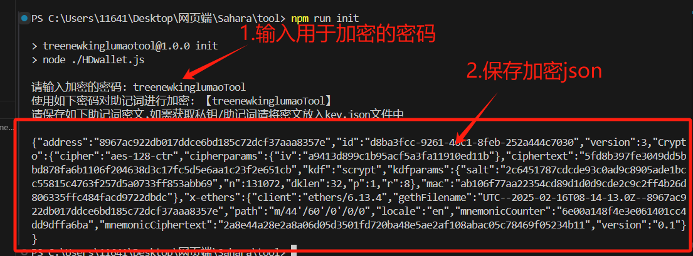
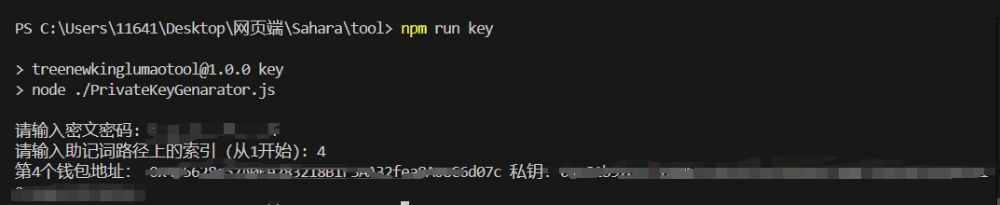
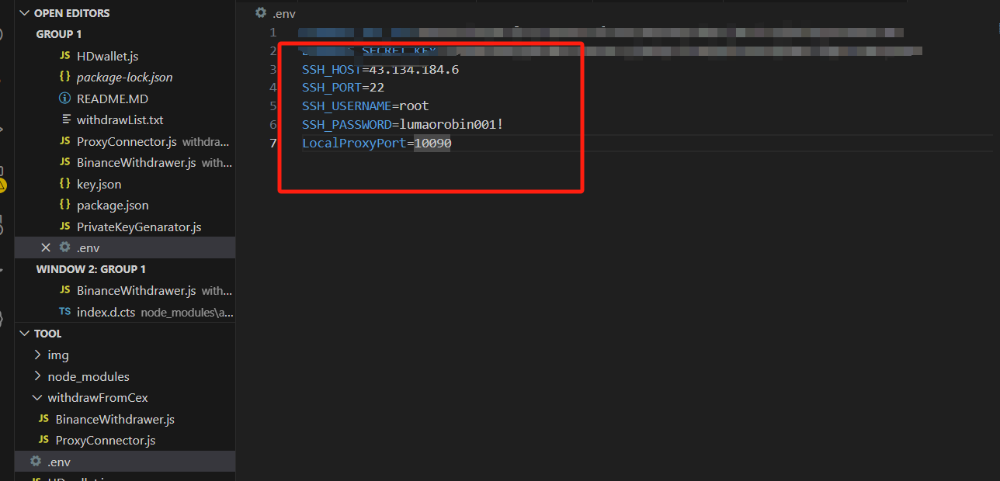
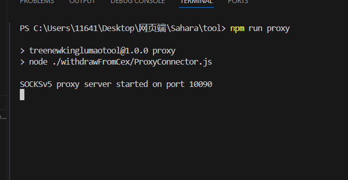
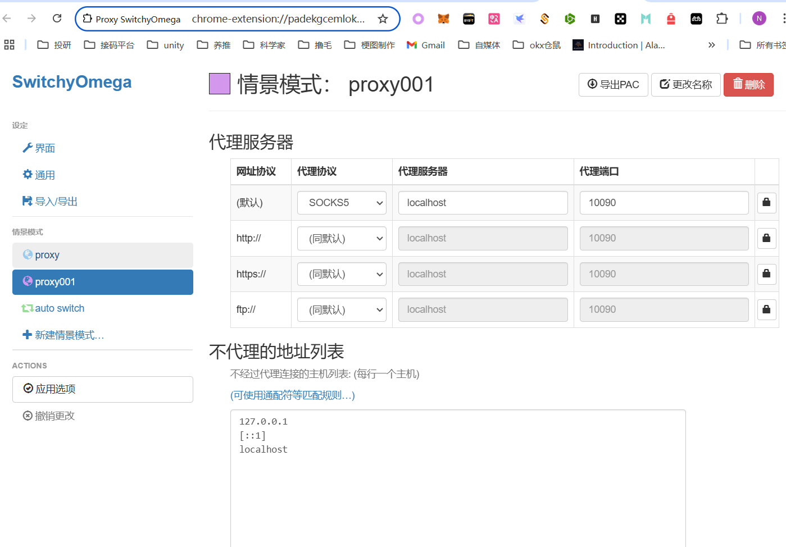
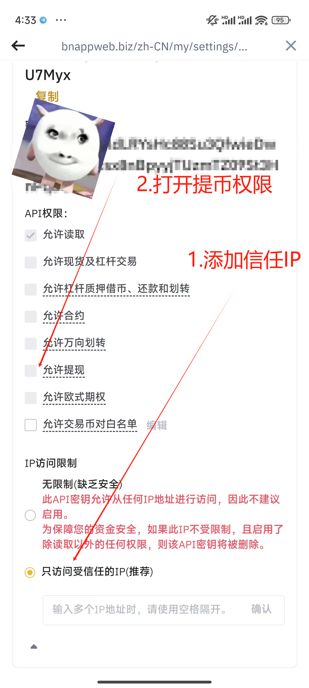
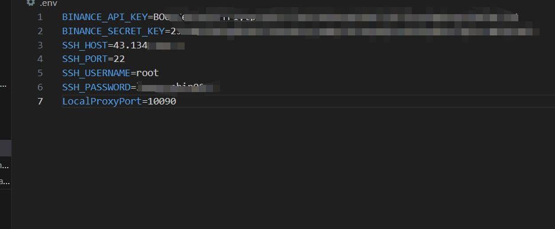
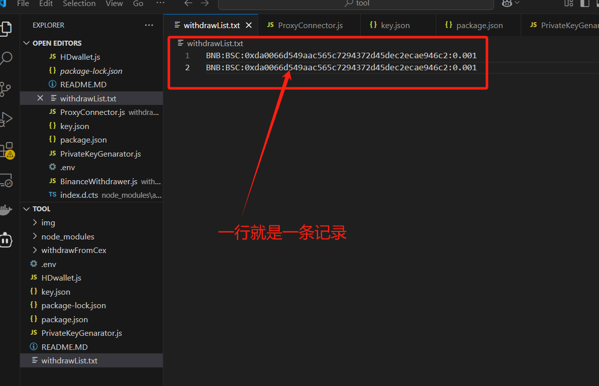
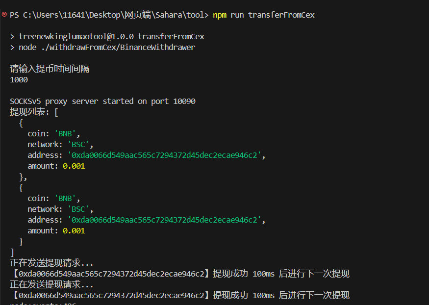
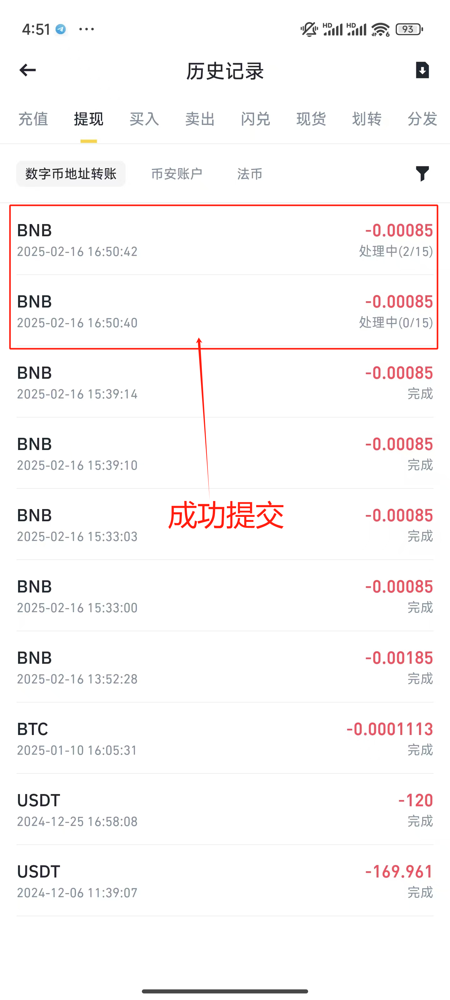

# 女巫发生器(撸毛用途)

# 简介

开发的一套撸毛工具,针对链上撸毛多号需求进行开发,针对市面上没有/收费的功能,进行开发并开源,简陋,但主打免费能用

| 功能                      | 描述                                      | 要求                                         |
| ------------------------- | ----------------------------------------- | -------------------------------------------- |
| 1.创建加密钱包            | 生成助记词的加密json                      | 用户输入加密的密码                           |
| 2.生成助记词的某个私钥    | 生成助记词的单地址私钥                    | 用户输入密码对助记词解密                     |
| 3.使用SSH协议建立代理通道 | 使用ssh进行ip代理(将本机某个端口代理出去) | 拥有一台具有公网IP的服务器并再.env中进行配置 |
| 4.交易所提币              | 从交易所进行批量提币(可用于转入gas等)     | 用户在.env文件中配置交易所的key和secret      |

下载node之后使用以下命令安装所需的包

```
npm i
```


# 1.创建加密钱包

```
npm run  init
```



# 2.生成助记词单个私钥

先将1.创建加密钱包 生成的加密json放入到key.json这个文件中之后使用以下命令

```
 npm run key  
```

输入密码之后,输入需要生成钱包的序号就可以获得对应的私钥和地址



# 3.使用SSH协议建立代理通道

先在.env目录中配置远程服务器的信息



然后启动代理

```
npm run proxy
```



然后使用浏览器的SwitchOmega等插件连接本地的端口就可以进行流量转发了



# 4.交易所提币

暂时接了Binance(币安)提币,先生成自己的key和secret,并将自己的ip(代理ip)加入到权限中去,打开提币



2.将key和secret以及ssh连接服务器的信息填入到.env当中



3.将需要转账的信息填入到withdrawList.txt当中

格式(Token:Network:Address:Number)



4.运行脚本设置转账时间间隔



