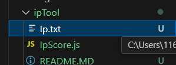
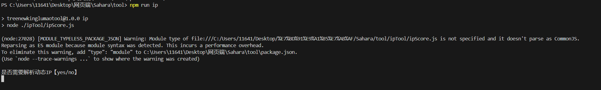
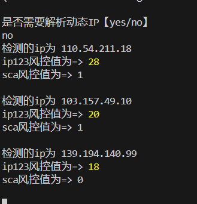
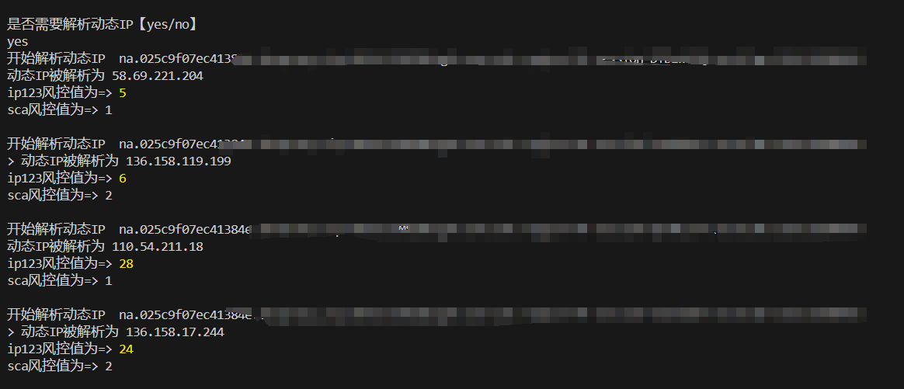

# 声明

本脚本只用作交流和学习用途,不可用于Ddos等非法用途

# 使用说明

| 功能         | 描述                             | 要求                  |
| ------------ | -------------------------------- | --------------------- |
| 解析动态ip   | 通过第三方网站批量解析动态ip地址 | 提供socks5链接        |
| 分析IP风控值 | 通过第三方网站批量查询ip风控值   | 提供socks5链接/IP地址 |

1.将【IP/socks5链接】 地址填入ipTool目录下的ip.txt文件



格式如下

```
110.54.211.18
103.157.49.10
139.194.140.99
```

或(ip:端口:账号:密码)

```
cc.025c932423384e.sdfsdsf.vip:4950:SJM8Z8KzgM-zone-dsfs-region-PH-session-DTBzwSSQ-sessTime-120:453453
cc.025c932423384e.sdfsdsf.vip:4950:SJM8Z8KzgM-zone-adsfs-region-PH-session-ha5dd62C-sessTime-120:453453
cc.025c932423384e.sdfsdsf.vip:4950:SJM8Z8KzgM-zone-sdfsd-region-PH-session-WyJWCZFP-sessTime-120:453453
```

2.启动脚本(根目录下运行)

```
npm run ip
```



Ip.txt填入的是ip地址则输入no,不进行ip解析



ip.txt输入的是socks5链接则选择yes进行解析



